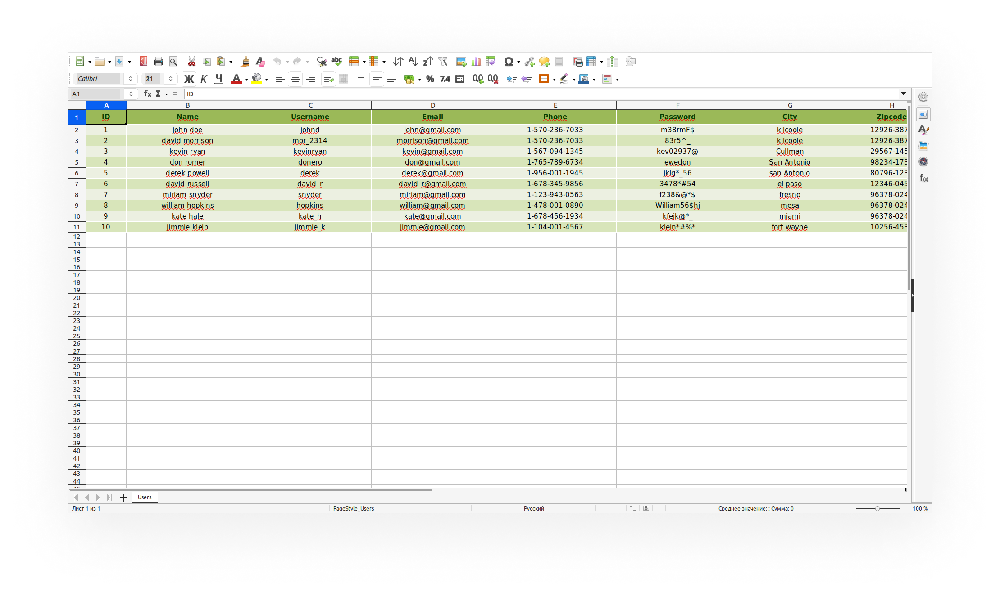

<p align="center"></p>


# Golang Excel
<p align="left">
    <a href="https://t.me/I0HuKc"></a> 
    <a href="https://opensource.org/licenses/BSD-3-Clause"></a>
</p>


## About
**go-excel** it's a simple golang library for quickly creating beautiful Excel tables. The library is based on <a href="https://github.com/qax-os/excelize">excelize</a>. Supports reading and writing spreadsheet documents generated by Microsoft Excel™ 2007 and later.


## Usage

### Installation

```go get https://github.com/I0HuKc/go-excel```

Then import the library into your `go` file

### Brief examples

To create a table, you need a table header object and an array of data that you want to write to the table. That's all you need to create a beautiful table quickly!

*You can find more detailed examples in the folder **<a href="https://github.com/I0HuKc/go-excel/tree/main/examples">examples</a>**.*

**Header params**

```go
// The row line from which the table will begin
var tableStartFromLine = 1

// Column names
var headValues = []string{"ID", "Name", "Username", "Email", "Phone", "Password", "City", "Zipcode"}

// Header parameters
var tableHeader excel.Header = excel.Header{
	CellParams: excel.CreateHeaderCell(headValues, strconv.Itoa(tableStartFromLine)),
	ColParams: []excel.ColWidth{
		{
			StartCol: "A",
			EndCol:   "A",
			Width:    10, // column width
		},
		{
			StartCol: "B",
			EndCol:   "F",
			Width:    30,
		},
		{
			StartCol: "G",
			EndCol:   "H",
			Width:    25,
		},
	},
	RowParams: []excel.RowHeight{
		{
			Row:    tableStartFromLine,
			Height: 25,
		},
	},
}
```

**Create data array**

The example uses test data structures, you can use data of any types and structures.

```go
	var tableValue [][]interface{}
	for _, v := range *data {
		tableValue = append(tableValue, []interface{}{
			v.Id,
			fmt.Sprintf("%s %s", v.Name.Firstname, v.Name.LastName),
			v.Username,
			v.Email,
			v.Phone,
			v.Password,
			v.Address.City,
			v.Address.Zipcode,
		})
	}
```

**Create XLSX file**

```go
excel.NewFile("users.xlsx")
```


**Create default table**

To create a table, you need to call only one method.

```go
excel.CreateDefaultTable(excel.DefaultTable{
		PathName:         "users.xlsx",
		TableHeader:      tableHeader,
		Data:             tableValue, // Data array written to the table
		Sheet:            "Users", // Sheet name
		ContentRowHeight: 18,
		ContentLineStart: tableStartFromLine + 1,
	});
```

Done!

<p align="center">
    

</p>


Don't forget to handle errors. The detailed **<a href="https://github.com/I0HuKc/go-excel/tree/main/examples">examples</a>** provide an example of how you can do it.


